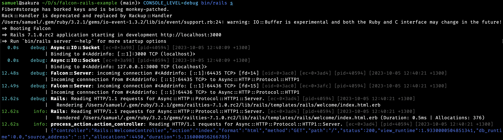

# Falcon Rails Example

This repository contains an example Rails application that uses Falcon as the web server. It also demonstrates how to use the `console` gem for logging, and how to use the `traces` gem for request tracing.

## Usage

To start the server using `rackup`:

```
> bin/rails server
```

To start the server using `falcon` directly:

```
> bundle exec falcon serve
```

This will bind to HTTPS / port 443.

## Required Changes

### `Gemfile` (or `gems.rb`)

Replace:

```ruby
gem 'puma'
```

with:

```ruby
gem 'falcon'
```

### Set Fiber Isolation

In `config/application.rb`:

```ruby
module MyApp
	class Application < Rails::Application
		# ...

		# Request per fiber:
		config.active_support.isolation_level = :fiber
	end
end
```

## Optional Changes

### Better Logging

Add the following gem:

```
> bundle add console-adapter-rails
```

In `config/environment.rb`:

```ruby
require 'application'

# Use console for logging:
require 'console/adapter/rails'
Console::Adapter::Rails.apply!
```

Example output:



### Logging to Datadog

Add the following gem:

```
> bundle add console-output-datadog traces-backend-datadog
```

Run with the following environment:

```
> TRACES_BACKEND=traces/backend/datadog CONSOLE_OUTPUT=Console::Output::Datadog,Console::Output::Default bin/rails server
```

`TRACES_BACKEND` will set up the traces library to use the Datadog backend. Falcon uses the traces library to log request/response information. The console gem can be used for logging, and the `Console::Output::Datadog` logging middleware adds the appropriate metadata to the log message so that it can be correlated with the traced span.

## WebSocket Example

### Chat Room

Included in the application is a simple chat room that uses WebSockets. To try it out, open two browser windows and open the application URL. You should see a chat input. Type a message in one window and it should appear in the other window. It uses the `async-websocket` gem and the `async-redis` gem. The implementaiton is deliberately bare-bones.
